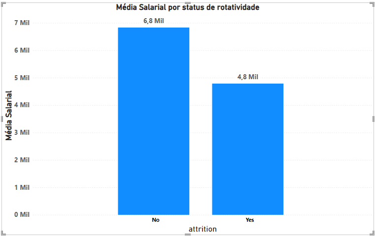

# 📊 Employee Automation Pipeline

Este projeto integra **Python, SQL e Power BI** para criar um fluxo automatizado para análises de dados. A solução transforma dados brutos em insights estratégicos para consultoria de RH.

## 🚀 Visão Geral
O objetivo deste projeto foi construir um pipeline que elimine a volatilidade dos dados e automatize a carga para ferramentas de BI, permitindo análises como esta, que trata especificamente sobre os fatores que levam os colaboradores a deixarem a empresa, o churn de funcionarios(Attrition).

## 📂 Fonte dos Dados
Os dados utilizados neste projeto são públicos e foram extraídos do Kaggle: 
* **Dataset:** [IBM HR Analytics Employee Attrition & Performance](https://www.kaggle.com/datasets/pavansubhasht/ibm-hr-analytics-attrition-dataset)
* **Descrição:** Dados fictícios da IBM usados para prever a rotatividade de funcionários.

## 🏗️ Arquitetura da Solução

### 1. Engenharia de Dados (ETL)
Utilizando **Python** no ambiente Google Colab, desenvolvi um pipeline automático que:
* Realiza a leitura dos dados brutos (CSV).
* Executa o processo de **ETL** (Extract, Transform, Load), limpando nomes de colunas e padronizando tipos de dados.
* Alimenta um banco de dados **SQLite**.

### 2. Infraestrutura e Persistência
Para garantir que os dados não fossem perdidos ao encerrar a sessão do Colab, implementei a persistência de dados diretamente no **Google Drive**. Isso permite que o banco de dados funcione como uma "fonte da verdade" ESTÁVEL para futuras consultas e conexões.

### 3. Validação Analítica (SQL)
Antes da visualização, utilizei queries **SQL** para validar as métricas de churn. Essa etapa foi fundamental para garantir a integridade dos cálculos de média salarial e contagem de funcionários.

### 4. Business Intelligence (BI)
O dashboard foi construído no **Power BI**, conectando-se ao arquivo `.db` através de um script Python. Isso demonstra uma integração avançada entre ferramentas, facilitando a atualização dos gráficos conforme novos dados são inseridos no pipeline.

## 📊 Insight Atual
A análise revelou que o salário é um fator crítico na retenção: colaboradores que deixam a empresa (**Churn: Yes**) ganham, em média, **R$ 2.000,00 a menos** do que os que permanecem.

## 🖼️ Dashboard

## 📂 Estrutura do Repositório
* `/scripts`: Scripts Python de ETL e Queries SQL.
* `/dashboard`: Arquivo .pbix do Power BI.
* `/img`: Capturas de tela do dashboard final.

---
**Projeto desenvolvido por Victor_Barbosa** *Transição de carreira para Dados | Estudante de ADS na Unifametro*
